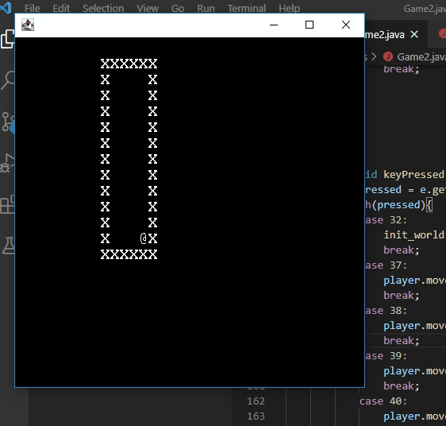

# char_crawl
simple game inspired by rogue/dugeon crawlers. experimenting to see how much fun can be had with mere text moving around the screen.

__latest progress__

## rough enemy. 

my concept of a separate thread for enemies wasnt right. got it rough implemented with a method call to update enemied before rendering. need to get timing worked out, but 
this is progress.

## door. placement. fully. implemented.

doors are now randomly placed on any wall. this is liberating and scary because now i have to face the tru challenge of building a game (in my view anyway), developing the 
enemies and defining the actual rules of the game. collecting items is simple enough, implementing coins wasn't anything crazy, but now i have to define the behaviors of a 
whole other 'player' in the game. i have to decide whether i want gameplay to be real-time or turn-based. im leaning strongly toward real-time, because i don't really 
understand how turn-based games work. i mean, its pretty straightforward i suppose, each time the player moves, the game-world and the enemies in the room take some action 
based on their positions. hmmm. turn-based could be interesting in the presence of the influence of Randu...

## my heart rejoices in the Lord. exploration.

the doors work! im not totally happy with the structure of the data at this point, im passing around references in a way that doesn't feel clean just yet, but everything i 
did felt completely resonable. it makes sense that a door object would have a reference to the game object simply because a door is not just an item in the game, it is in 
effect a piece of the machinery; it transports the player between rooms and therefore acts almost as an input device, right? to maintain the separation of concerns, all it 
does is call a method of the game class that actually makes the changes to the data model, so the 'veil' is not broken, though perhaps it is rather thin. i see this as okay 
as long as i stay true to only having the data model change in the game class where it resides, references and method calls are fine, that's what theyre for. 

next i need to finish up implementing the random placement of doors with east and south walls. though there are already doors placed on those walls, they are only placed 
there as a result of an opposing wall being placed first. as a result the game only moves from east to west or from south to north. once that's done i can restructure 
everything to clean up the code, and begin to think about items and enemies.

## More Doors

doors now placed on north wall (and south wall of next room by default). rewired the door class to change glyph depending on door orientation. this is getting interesting!

## Rough Doors

so i've added a rough implementation of doors. right now theyre all in a chain with a west wall adjoining the next room's east wall. the spacebar move you between the rooms
as a test for consistency. i began with a valiant attempt to randomly place the door on any wall at any location. that proved overwhelming to attack at once so im going in
chunks starting with the west wall. next ill add the north wall and so on. i'm working in branches this time, because a broken version would prove the end at this point.

im trying to focus on keeping it simple to save the project. i can see how things could fall apart if i naively go for too much. for instance, i initially wanted to move 
randomly through the array of dungeons connecting the rooms together. this was stupid and added unnecessary complexity. the rooms are already randomly generated, so doing 
more serves no purpose. then i wanted to check if the dimensions of the rooms and connection points caused overlap with other rooms. if so, i wanted to remove the door in 
that room, and add a staircase since if they overlapped it meant one must be above the other since ive not implemented non-rectangular rooms. now, i still want to do this, but 
this is definitely not something to go for when i haven't even fully defined the door class yet! the struggle would likely kill progress at this point, so i have to proceed in
small chunks. that said, after getting random door placement fully implemented, i see an opportunity to begin attempting simple geometry checks to see if a room is say, wider 
than it is long and if the room it connects to is of a certain dimension, forcing the placement of the wide room so that it doesnt overlap with other rooms. with those checks 
in place id have the machinery to check for intersections and could implement the stair placement. however, before that, it's be great just to get doors not only placed, but 
functional, and implement a few items, like keys, and get them placed in the rooms, then get some enemies working. with that in mind, i still have to decide how the game will 
work: will it be turn-based?

## i hate this crap; i am insane. i love this, i am beautiful.

so this is getting deeper now. i went around youtube watching gameplay of legit roguelikes and decided to go ahead and go for some legitimacy and add some random generation 
features. so i restructured the game a bit: the "world" is now composed of a dungeon made up of randomly generated rooms. the number of rooms in the dungeon is randomly 
decided when the game class is instantiated with a limit passed in that sets the max number of rooms. right now this limit also acts as the limit of the size of the rooms, 
though i'm pretty sure that will change as i want to ensure diversity in the room sizes. ive defined two different random number generator methods (both subject to the will 
and whim of Randu (check out _the friendly orange glow_ by brian dear)), one for use regular in-game interactions when the range isnt important, and the other with the option 
to set a min and max that i'm using right now to make sure the rooms aren't too small to move around. i wired up the spacebar to re-init the dungeon for testing purposes for 
the next challenge, which is placing doors and ensuring that movement between rooms is possible and that the map remains consistent. 

i count today as a special day for me along my little programming journey. today i ventured out into the wider world of github and looked at another project for ideas. this 
is a big deal for me as i've never done that before for a couple of reasons: 1. most projects on github are fairly large and use build systems im not familiar enough with 
to be able to find the entry point of the code to make any sense of the project in a reasonable amount of time. 2. because looking at other people's code always felt like 
"cheating" because of this self-conciousness i used to have at being a __n00b__. thing is, i dont care about other people anymore. ive found my own groove. ill probably 
never be a pro dev, and that's cool. i find little opportunities to write scripts in my job in IT when i feel like it. so to me being able to look to other projects for 
help in figuring out a tough problem is a sign of personal growth. The project i checked out was the roguelike angband. its written in c and the structure of the source 
was very friendly at least in that the source files were very semantically named. I was able to find some of the prcedural generation code fairly easily by just following 
the names of the source files. from one of them i learned that while procedural generation is about as daunting as i imagined, some of the ideas were quite intuitive and 
therefore some of the naive strtegies i had devised in my head were actually vaild for making something simple. this is a bit of a breakthrough.

## how's about a little greed?

added first collectible item, gold coins. also made gameboard adjust with the window to remain centered. no idea why i took that on, it took extra time to figure out 
but i think it could be useful later as i'd like to make the gameboard larger on fullscreen or beyond a certain large size. next i think ill add an area on screen for 
printing messages for when items are collected and for keeping track of energy levels. there were some interesting decisions to be as i built in the coins. I decided 
that items should have an intrinsic method that is called when they are encountered by the player, or more generically by any other gamepiece. i created an interface, 
game_item, that stipulates this method. in the coin class, i overloaded collected(Player collector) with collected(Gamepiece collector) as i thought it might be cool 
at some point to have an enemy or other entity collect coins. perhaps a certain number of coins is necessary to accomplish some task in a level and the player must race 
against an enemy to collect enough before the enemy destrys them all or something. there's something clean to me about having the coin itself augment the player's gold 
value and then nullify itself so there's no need to screw around with modifying the game board or map when an item is collected. i'm kinda proud of structuring it that 
way. after adding the messages, i think i need to tackle random item generation and decide whether i want levels to be randomly generated or predefined. I also need to 
figure out what i want the game to look like. do i want there to be scrolling of some sort? do i want there to be doors that load new rooms when you walk through them?
i'm leaning that way because as the name of this repo suggests, there is the spirit of a dungeon crawler here. the though of that is exciting. perhaps i need to start 
thinking of enemies first?

## broke it, restarted...

commiting directly to master finally slew me. while sketching out moving gamepieces and updating them on screen, i built myself into a non-working state and 
didn't feel like reverting commits to get back to a working version, so i just re-implemented everything from scratch. this worked out as i got past my sticking point.
i managed to create a clean enough relationship between the gamepiece objects with their position data and what-not and the char array that serves to build the 
strings that ultimately represent them on screen. the key ended up being giving each game object a reference to the world they live in, map[][]. this makes moving 
much nicer in that the data model and the view are separated cleanly. gamepieces can move around in map[][] and board[][] can just be updated to show any changes just before 
rendering. next i need to implement collision detection and the basics of how gempieces will interact. right now, as the demo shows, the player can go out of bounds.

## first test demo
basic movement implemented. maybe let's collect some coins next?

